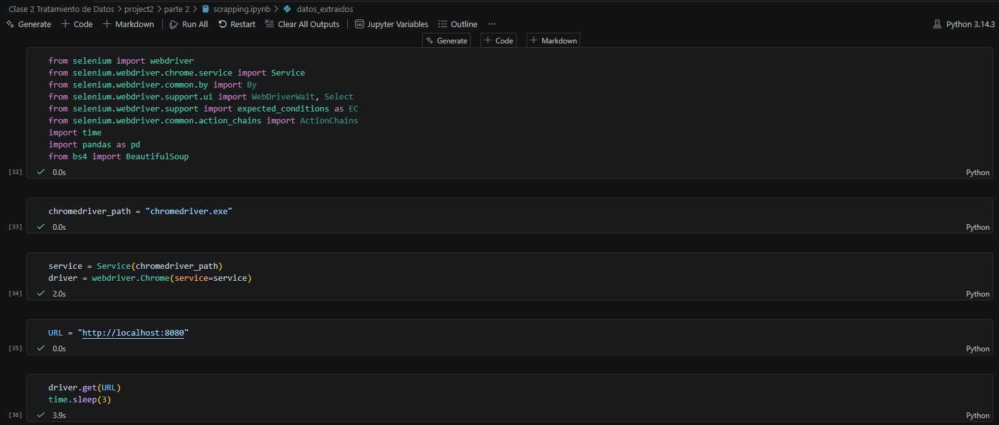
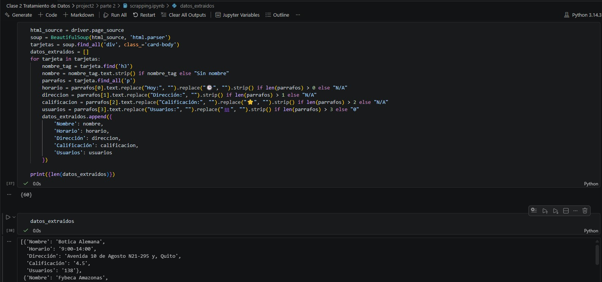
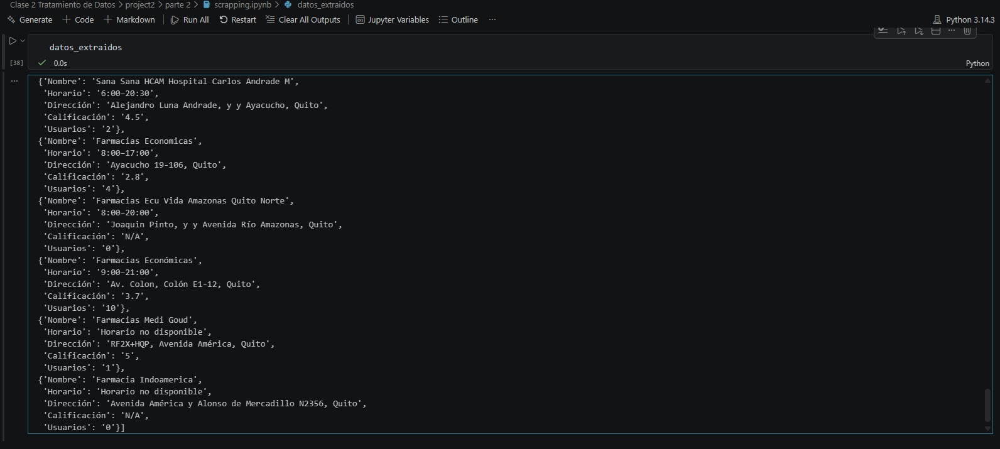
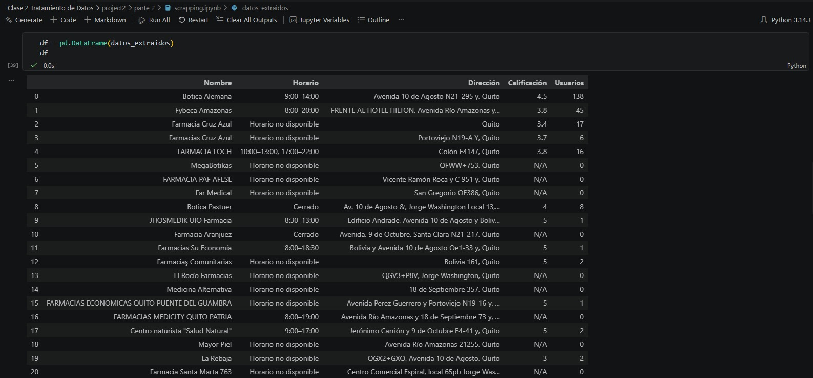
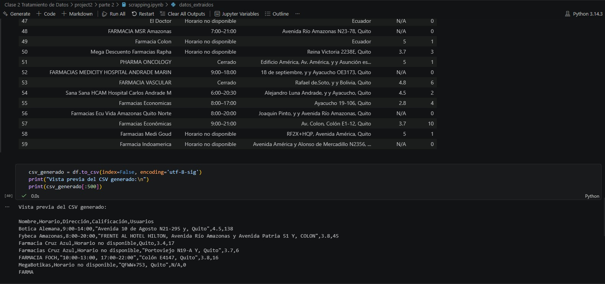
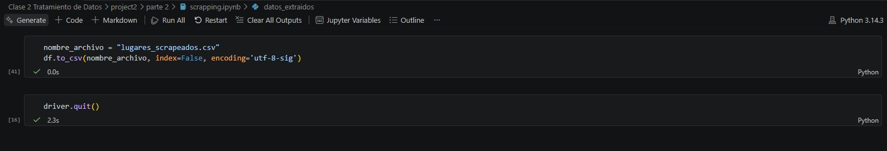
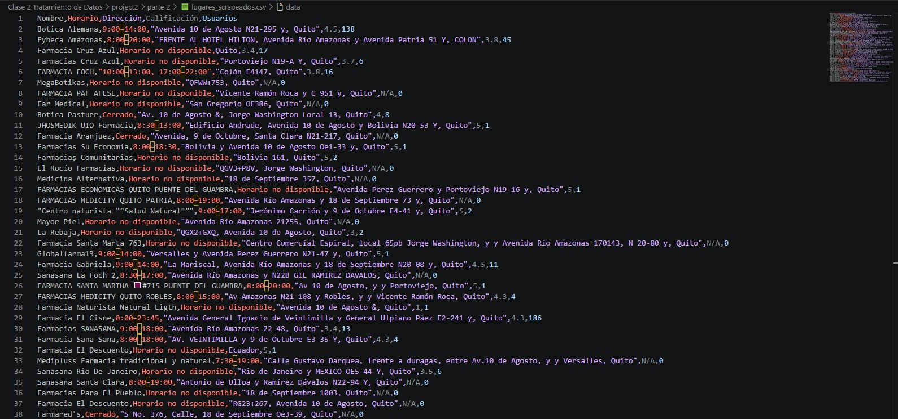

  

<h1 align="center">Laboratorio 2 - Grupo 6</h1>

  <b>MCIB-B</b> 
  Trabajo grupal enfocado en el proceso de web scraping

<h2>Integrantes</h2>

<ul>
  <li>AMAGUA OSCAR</li>
  <li>OJEDA ALAN</li>
  <li>SUNTAXI DIEGO</li>
</ul>

<h2>Introducción</h2>

En esta segunda parte del proyecto se aborda el proceso de web scraping, una técnica fundamental para la obtención de datos desde fuentes abiertas en la web. El objetivo principal es seleccionar una página pública y extraer de ella datos estructurados, aplicando un flujo de trabajo completo que permita transformar la información obtenida en datos útiles y reutilizables.
  
Para ello, se realiza la extracción automatizada de información, seguida de una fase de limpieza y procesamiento de los datos, con el fin de garantizar su calidad y consistencia. Una vez tratados, los datos resultantes se almacenan en formato CSV, facilitando su análisis posterior y su compatibilidad con otras herramientas.

Finalmente, todo el código desarrollado durante el proceso se publica en un repositorio independiente, fomentando buenas prácticas como el control de versiones, la organización del proyecto y la reproducibilidad del trabajo realizado.

<h2>Objetivo</h2>

Diseñar, construir y desplegar un API funcional, aplicando buenas prácticas de desarrollo, versionamiento, pruebas y despliegue local usando FastAPI.

<h2>Parte 2 – Web Scrapping</h2>

<h3>Repositorio del proyecto</h3>
<ul>
  <li>Código fuente del API</li>
  <li>README documentado</li>
  <li>Notebook Jupiter pruebas iniciales</li>
  <li>Dockerfile funcional</li>
  <li>Archivo CSV con los datos extraídos directamente del scraping</li>
  <li>Archivo CSV final con los datos limpios, procesados y estructurados</li>
  <li>Versión en formato Excel de los datos finales.</li>
  
</ul>

<h3>API funcional</h3>
<ul>
  <li>Flask</li>
  <li>FastAPI</li>
  <li>Otro framework Python aprobado</li>
</ul>

<h3>Funcionalidades mínimas</h3>
<ul>
  <li>Endpoint <b>GET</b></li>
  <li>Endpoint <b>POST</b></li>
  <li>Validación básica de datos</li>
  <li>Respuestas en formato JSON</li>
</ul>

<h3>Creatividad</h3>
<ul>
  
  <li>Integración con APIs externas</li>
  <li>Procesamiento de datos</li>
  <li>Demos de Soluciones tecnológicas</li>

</ul>

<h3>Evidencia</h3>
<h5>Codigo API</h5>
<ul>
<li>El código muestra la configuración de un entorno de web scraping con Selenium, donde se utiliza un navegador automatizado para acceder a una API (http://localhost:8000). Esta integración permite consumir datos del servicio, procesarlos posteriormente y almacenarlos de forma estructurada dentro del proyecto.</li>
</ul>

  
  

<h5>Extracción y estructuración de datos HTML con BeautifulSoup</h5>
<ul>
<li>El código procesa el contenido HTML obtenido mediante Selenium utilizando BeautifulSoup, extrae datos estructurados de cada tarjeta (nombre, horario, dirección, calificación y usuarios) y los almacena en una lista de diccionarios, que luego se imprime y sirve como base para su posterior guardado en CSV.
</li>
</ul>

  

<h5>Resultados de los datos extraídos</h5>
<ul>
<li>La imagen muestra la salida de datos estructurados obtenidos mediante web scraping, donde se listan varios establecimientos con información como nombre, horario, dirección, calificación y número de usuarios, almacenados en una estructura tipo diccionario.
</li>
</ul>

  

<h5>Tabla de datos procesados</h5>
<ul>
<li>La imagen muestra los datos extraídos y procesados convertidos en un DataFrame de pandas, donde se organizan campos como nombre, horario, dirección, calificación y número de usuarios, facilitando su visualización y posterior exportación a formatos como CSV o Excel.
</li>
</ul>

  

<h5>Generación y vista previa del archivo CSV</h5>
<ul>
<li>La imagen muestra la exportación de los datos procesados a un archivo CSV, junto con una vista previa del contenido generado, confirmando que la información extraída fue correctamente estructurada y guardada para su uso final.
</li>
</ul>

  

<h5>Guardado final de datos en CSV</h5>
<ul>
<li>La imagen muestra la exportación final de los datos extraídos a un archivo CSV (lugares_scrapeados.csv), utilizando pandas, y el cierre correcto del navegador automatizado, dando por finalizado el proceso de web scraping.
</li>
</ul>

  

<h5>Contenido del archivo CSV generado</h5>
<ul>
<li>La La imagen muestra el contenido del archivo CSV generado, donde se almacenan los datos finales obtenidos del scraping, organizados por columnas como nombre, horario, dirección, calificación y número de usuarios, listos para su uso y análisis.
</li>
</ul>

  

<h5>historial de commits del repositorio en GitHub</h5>

  

<h3>Comentario</h3>

  En esta fase se desarrolló la estructura base del API, implementando endpoints GET y POST con validaciones básicas. 
  Se utilizó FastAPI por su facilidad de uso y documentación automática.

``
<h2>Parte 2 – Uso de Branches</h2>

  Se desarrollaron funcionalidades en ramas independientes y luego se integraron a la rama principal <code>main</code>.

<ul>
  <li><code>feature/geolocalizacion</code></li>
  <li><code>feature/scoring</code></li>
  <li><code>feature/auth</code></li>
</ul>

<h3>Evidencia</h3>
<h5>Historial de cambios en ramificaciones</h5>

  

<h5>Estructura de ramificaciones de git</h5>

  

<h3>Comentario</h3>

  El uso de branches permitió trabajar de manera organizada y evitar conflictos en el código principal, facilitando la integración continua.

<h2>Parte 3 – Contenerización</h2>

<ul>
  <li>Dockerfile funcional</li>
  <li>Imagen construida sin errores</li>
  <li>Contenedor ejecutando correctamente</li>
</ul>

<h3>Evidencia</h3>
<h5>Creación del docker</h5>

  

<h5>Estructura del docker</h5>

  

<h5>Prueba de creacion del docker sin error</h5>

  

<h3>Comentario</h3>

  Se logró contenerizar el API correctamente, permitiendo su ejecución en cualquier entorno sin dependencias externas.

<h2>Parte 4 – Pruebas con curl</h2>

<ul>
  <li>GET funcionando</li>
  <li>POST funcionando</li>
  <li>Manejo de errores</li>
</ul>

<h3>Evidencia</h3>
<h5>Prueba de funcionalidad endpoints GET y POST con Curl</h5>

  

<h5>Prueba de funcionalidad validación errores con Curl</h5>

  

<h3>Comentario</h3>

  Las pruebas con curl permitieron validar el correcto funcionamiento de los endpoints y el manejo adecuado de errores.

<h2>Parte 5 – Despliegue en Cloud</h2>

<ul>
  <li>Cloud Run</li>
  <li>Compute Engine</li>
  <li>Otro servicio cloud</li>
</ul>

<h3>Evidencia</h3>
<h5>Proceso de despliegue en Google Cloud</h5>

  
  

<h5>Verificación de funcionalidad de endpoints</h5>

  

<h5>Verificación de metricas generadas de la API</h5>

  

<h5>Eliminación del despliegue</h5>

  

<h3>Comentario</h3>

  El despliegue en la nube permitió acceder al API de forma remota, garantizando disponibilidad y escalabilidad.

<h2>Conclusiones</h2>
<ul>
  <li>La correcta configuración de las variables globales de Git es fundamental para identificar adecuadamente los commits y mantener un historial limpio en trabajos colaborativos.</li>
  <li>El flujo adecuado de trabajo siempre debe iniciar con un git pull, seguido del desarrollo, commit y finalmente un git push, evitando conflictos y pérdidas de información.
El uso de ramas permite trabajar de forma ordenada sin afectar la rama principal, facilitando la revisión y la integración de cambios mediante Pull Requests.</li>
  <li>La integración de variables sensibles mediante .env dentro del flujo de Docker proporcionó un nivel adicional de organización y seguridad. Esto evitó exponer claves privadas o configuraciones críticas en el repositorio, manteniendo buenas prácticas en la gestión de credenciales y configuraciones.</li>
  <li>El uso de Docker permitió estandarizar completamente el entorno de ejecución, garantizando que la API se comporte de la misma manera en cualquier máquina. Esto eliminó problemas recurrentes asociados a diferencias en versiones de Python, dependencias o configuraciones locales entre los integrantes del equipo.</li>
  <li>La integración del archivo .env dentro del flujo de Docker reforzó la seguridad al evitar exponer claves sensibles, además de simplificar la configuración del entorno.</li>
  <li>El archivo .env no funcionó correctamente en GCloud porque incluía variables que la plataforma tiene reservadas, como PORT. Como medida de seguridad, GCloud activa un bloqueo por timeout cuando una aplicación no arranca de manera adecuada, lo que impidió que la API se desplegara correctamente. Para solucionar esto, fue necesario eliminar esas variables del entorno y configurar únicamente los secretos válidos, permitiendo que Cloud Run arrancara la API correctamente y sin bloquearla.</li>
</ul>

