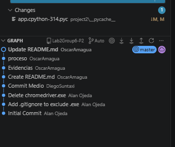

  

<h1 align="center">Laboratorio 2 - Grupo 6</h1>

  <b>MCIB-B</b> 
  Trabajo grupal enfocado en el proceso de web scraping

<h2>Integrantes</h2>

<ul>
  <li>AMAGUA OSCAR</li>
  <li>OJEDA ALAN</li>
  <li>SUNTAXI DIEGO</li>
</ul>

<h2>Introducción</h2>

En esta segunda parte del proyecto se aborda el proceso de web scraping, una técnica fundamental para la obtención de datos desde fuentes abiertas en la web. El objetivo principal es seleccionar una página pública y extraer de ella datos estructurados, aplicando un flujo de trabajo completo que permita transformar la información obtenida en datos útiles y reutilizables.
  
Para ello, se realiza la extracción automatizada de información, seguida de una fase de limpieza y procesamiento de los datos, con el fin de garantizar su calidad y consistencia. Una vez tratados, los datos resultantes se almacenan en formato CSV, facilitando su análisis posterior y su compatibilidad con otras herramientas.

Finalmente, todo el código desarrollado durante el proceso se publica en un repositorio independiente, fomentando buenas prácticas como el control de versiones, la organización del proyecto y la reproducibilidad del trabajo realizado.

<h2>Objetivo</h2>

Diseñar, construir y desplegar un API funcional, aplicando buenas prácticas de desarrollo, versionamiento, pruebas y despliegue local usando FastAPI.

<h2>Parte 2 – Web Scrapping</h2>

<h3>Repositorio del proyecto</h3>
<ul>
  <li>Código fuente del API</li>
  <li>README documentado</li>
  <li>Notebook Jupiter pruebas iniciales</li>
  <li>Dockerfile funcional</li>
  <li>Archivo CSV con los datos extraídos directamente del scraping</li>
  <li>Archivo CSV final con los datos limpios, procesados y estructurados</li>
  <li>Versión en formato Excel de los datos finales.</li>
  
</ul>

<h3>API funcional</h3>
<ul>
  <li>Flask</li>
  <li>FastAPI</li>
  <li>Otro framework Python aprobado</li>
</ul>

<h3>Funcionalidades mínimas</h3>
<ul>
  <li>Endpoint <b>GET</b></li>
  <li>Endpoint <b>POST</b></li>
  <li>Validación básica de datos</li>
  <li>Respuestas en formato JSON</li>
</ul>

<h3>Creatividad</h3>
<ul>
  
  <li>Integración con APIs externas</li>
  <li>Procesamiento de datos</li>
  <li>Demos de Soluciones tecnológicas</li>

</ul>

<h3>Evidencia</h3>
<h5>Codigo API</h5>
<ul>
<li>El código muestra la configuración de un entorno de web scraping con Selenium, donde se utiliza un navegador automatizado para acceder a una API (http://localhost:8000). Esta integración permite consumir datos del servicio, procesarlos posteriormente y almacenarlos de forma estructurada dentro del proyecto.</li>
</ul>

  
  

<h5>Extracción y estructuración de datos HTML con BeautifulSoup</h5>
<ul>
<li>El código procesa el contenido HTML obtenido mediante Selenium utilizando BeautifulSoup, extrae datos estructurados de cada tarjeta (nombre, horario, dirección, calificación y usuarios) y los almacena en una lista de diccionarios, que luego se imprime y sirve como base para su posterior guardado en CSV.
</li>
</ul>

  

<h5>Resultados de los datos extraídos</h5>
<ul>
<li>La imagen muestra la salida de datos estructurados obtenidos mediante web scraping, donde se listan varios establecimientos con información como nombre, horario, dirección, calificación y número de usuarios, almacenados en una estructura tipo diccionario.
</li>
</ul>

  

<h5>Tabla de datos procesados</h5>
<ul>
<li>La imagen muestra los datos extraídos y procesados convertidos en un DataFrame de pandas, donde se organizan campos como nombre, horario, dirección, calificación y número de usuarios, facilitando su visualización y posterior exportación a formatos como CSV o Excel.
</li>
</ul>

  

<h5>Generación y vista previa del archivo CSV</h5>
<ul>
<li>La imagen muestra la exportación de los datos procesados a un archivo CSV, junto con una vista previa del contenido generado, confirmando que la información extraída fue correctamente estructurada y guardada para su uso final.
</li>
</ul>

  

<h5>Guardado final de datos en CSV</h5>
<ul>
<li>La imagen muestra la exportación final de los datos extraídos a un archivo CSV (lugares_scrapeados.csv), utilizando pandas, y el cierre correcto del navegador automatizado, dando por finalizado el proceso de web scraping.
</li>
</ul>

  

<h5>Contenido del archivo CSV generado</h5>
<ul>
<li>La La imagen muestra el contenido del archivo CSV generado, donde se almacenan los datos finales obtenidos del scraping, organizados por columnas como nombre, horario, dirección, calificación y número de usuarios, listos para su uso y análisis.
</li>
</ul>

  

<h5>historial de commits del repositorio en GitHub</h5>

  

<h3>Comentario</h3>

El proyecto abarcó la extracción, limpieza y almacenamiento de datos mediante web scraping, integrando una API local y utilizando GitHub para el control de versiones y el trabajo colaborativo, siguiendo un flujo de desarrollo ordenado y reproducible.

<h2>Conclusiones</h2>
<ul>
  <li>El proyecto permitió aplicar de manera práctica un flujo completo de tratamiento de datos, desde la extracción mediante web scraping hasta el almacenamiento final en formatos estructurados como CSV y Excel.</li>
  <li>El uso de herramientas como Selenium, BeautifulSoup y pandas facilitó la automatización, limpieza y organización de los datos, mejorando su calidad y utilidad para futuros análisis.</li>
  <li>La integración de una API funcional en entorno local demostró cómo los datos procesados pueden ser expuestos y consumidos por otros sistemas, fortaleciendo la arquitectura del proyecto.</li>
  <li>La utilización de GitHub como sistema de control de versiones permitió un trabajo ordenado y colaborativo, evidenciando la importancia de los commits y la documentación en proyectos de desarrollo.</li>
  <li>En conjunto, el proceso seguido refleja buenas prácticas en la gestión de datos y desarrollo de software, asegurando un trabajo reproducible, organizado y alineado con entornos reales.
</li>
</ul>

